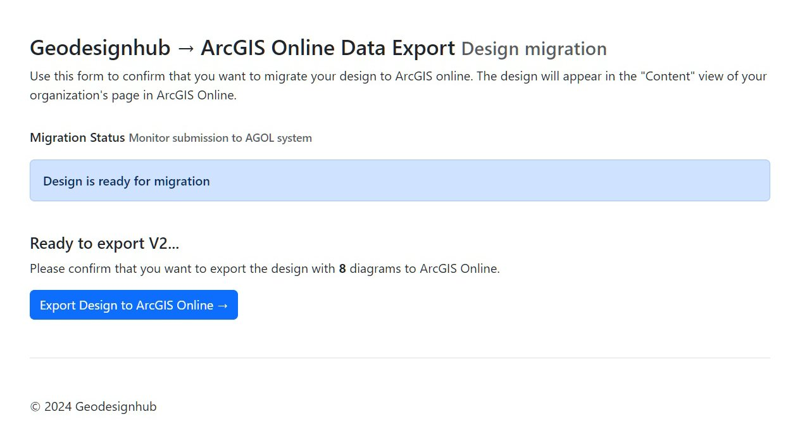

# ESRI <-> Geodesignhub Bridge (v2)

App using ArcGIS API for Python to connect to discover and migrate content from Geodesignhub and ArcGIS online.

### APIs Used

 - [ArcGIS API for Python](https://developers.arcgis.com/python/)
 - [Geodesignhub](https://www.geodesignhub.com/)
 - [Geodesignhub API](https://www.geodesignhub.com/api/)

### The Process

This app is used as a Geodesignhub plugin and can be added to your project via the Geodesignhub plugins panel. The import diagrams from AGOL is currently setup as a "administrator only" privileges and the export feature is available to every member of a Geodesighub project.

### Pre-requisites
As a pre-requisite to using this plugin, you must create a project with ESRI connections that must be linked, you can mention this to your Geodesignhub project administrator. 

### Screenshots

### Import data from Geoplanner
Available for Project Administrators

### Export to Geoplanner / ArcGIS
Available to everyone

## Adding the plugin

The plugin can be added to a project through the project administration panels in Geodesignhub.

