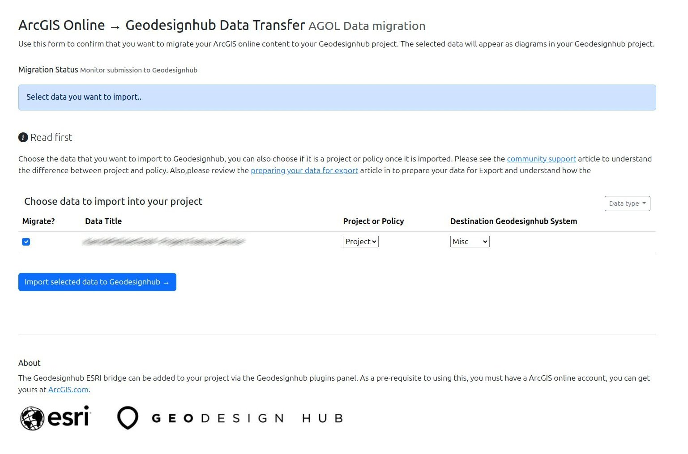

# ESRI <-> Geodesignhub Bridge (v2)

App using ArcGIS API for Python to connect to discover and migrate content from Geodesignhub and ArcGIS online.

### APIs Used

 - [ArcGIS API for Python](https://developers.arcgis.com/python/)
 - [Geodesignhub](https://www.geodesignhub.com/)
 - [Geodesignhub API](https://www.geodesignhub.com/api/)

### The Process

This app is used as a Geodesignhub plugin and can be added to your project via the Geodesignhub plugins panel. The import diagrams from AGOL is currently setup as a "administrator only" privileges and the export feature is available to every member of a Geodesighub project.

### Pre-requisites

As a pre-requisite to using this plugin, you must create a project with ESRI connections that are properly linked. Please coordinate with your Geodesignhub project administrator to ensure the connections are set up correctly.

### Screenshots
Here are some screenshots showcasing the functionality of the plugin:

### Import data from AGOL

🌟 See Geodesignhub [community article](https://community.geodesignhub.com/t/import-data-from-arcgis-online-esri-systems-to-your-project/1437)

### Export to Geoplanner / ArcGIS

=======
### Import data from ArcGIS Online
Available for Project Administrators

🌟 See Geodesignhub [community article](https://community.geodesignhub.com/t/exporting-your-design-to-arcgis-online-esri-systems/1430)

## Adding the plugin

The plugin can be added to a project through the project administration panels in Geodesignhub.

