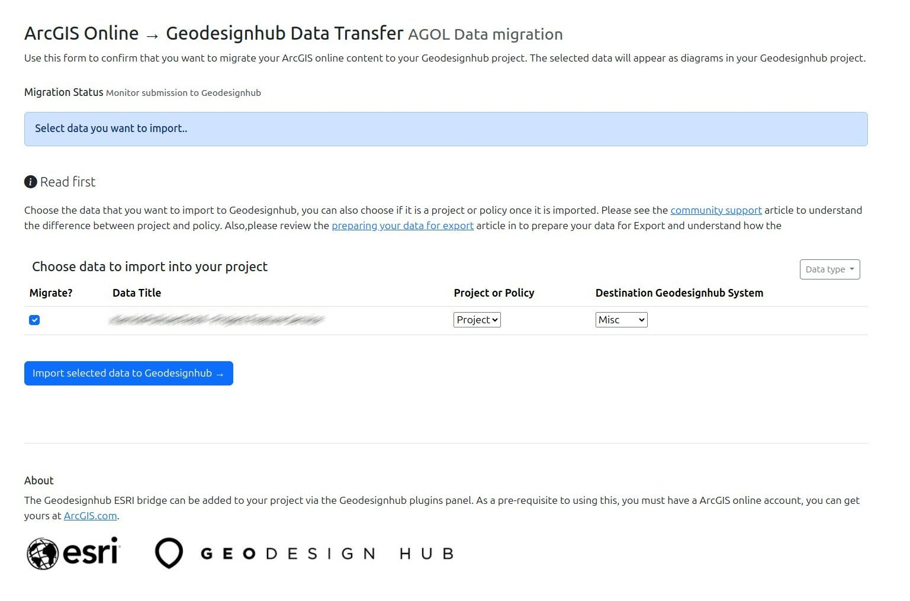
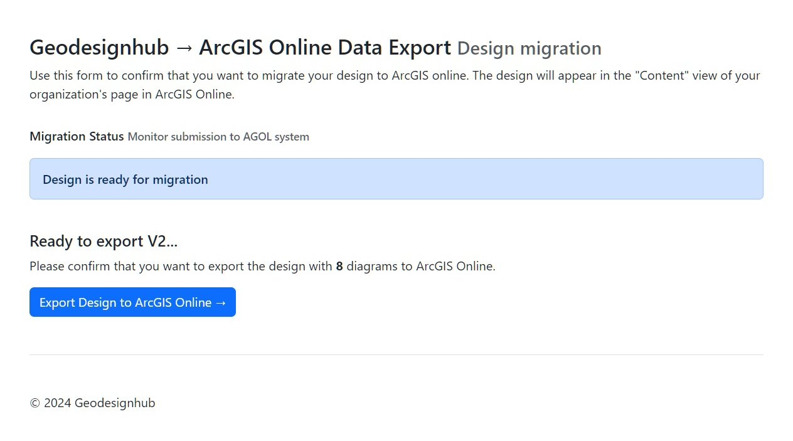

# ESRI <-> Geodesignhub Bridge 

This application leverages the ArcGIS API for Python to facilitate the discovery and migration of content between Geodesignhub and ArcGIS Online.

## APIs Used

- [ArcGIS API for Python](https://developers.arcgis.com/python/)
- [Geodesignhub](https://www.geodesignhub.com/)
- [Geodesignhub API](https://www.geodesignhub.com/api/)

## Overview

The app functions as a Geodesignhub plugin, accessible via the Geodesignhub plugins panel. It allows project administrators to import diagrams from ArcGIS Online (AGOL) and enables all project members to export designs to AGOL.

## Pre-requisites

To use this plugin, ensure that your Geodesignhub project is configured with properly linked ESRI connections. Please coordinate with your Geodesignhub project administrator to verify the setup.

## Features

### Import Data from ArcGIS Online (AGOL)

This feature is available exclusively to project administrators.



🌟 Learn more in the Geodesignhub [community article](https://community.geodesignhub.com/t/import-data-from-arcgis-online-esri-systems-to-your-project/1437).

### Export to GeoPlanner / ArcGIS Online

All project members can export designs to AGOL.



🌟 Learn more in the Geodesignhub [community article](https://community.geodesignhub.com/t/exporting-your-design-to-arcgis-online-esri-systems/1430).

## Adding the Plugin

The plugin can be added to a project through the project administration panels in Geodesignhub.

## Development Setup

This project uses [uv](https://docs.astral.sh/uv/) for dependency management.

### Install uv

```bash
curl -LsSf https://astral.sh/uv/install.sh | sh
```

### Install dependencies

```bash
uv sync
```

### Run the application

```bash
uv run gunicorn app:app
```

### Run tests

```bash
uv run pytest
```

### Add a dependency

```bash
uv add <package>
```
